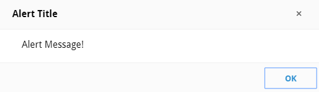

# Alert.Alert

/ [Home](../../../) / [Alert Library](../overview) / Alert.Alert

??? "Authors"
    Jun Zheng (junthehacker)

Alert dialog class.



## Properties

### `#!js public title`

The title to display.

### `#!js public message`

The message to display.

### `#!js public callback`

Callback function after user presses OK.

## Methods

### `#!js constructor(title, message, callback)`

The constructor, `message` and `callback` are optional, if you only provide the `title` then it will become message.

```javascript
var my_alert = new Alert.Alert("title", "message", function(){
   // code here 
});
```

### `#!js show()`

Show the alert instance.

### `#!js static spawn(title, message, callback)`

Spawn an anonymous alert instance.

The usage is same as constructor, this method does not return anything.

